## Load and sample the data

The data is a SQLite database, using DBI and dbplyr to query the database. The dataset is downloaded from [Kaggle](https://www.kaggle.com/nolanbconaway/pitchfork-data)

```r
library(DBI)
# Create an ephemeral in-memory RSQLite database
con <- dbConnect(RSQLite::SQLite(), "./database.sqlite")
```


```r
reviews <- tbl(con, "reviews")
artists <- tbl(con, "artists")
content <- tbl(con, "content")
genres <- tbl(con, "genres")
years <- tbl(con, "years")
```


```r
allContent <- reviews %>% 
  inner_join(content, by=c("reviewid"="reviewid")) %>% 
  arrange(desc(pub_year)) %>% 
  select(reviewid, title, artist, score, author, author_type, content, pub_year, best_new_music) %>% 
  distinct() %>% 
  collect()

allContent1 <- allContent %>% 
  mutate(best_new_music=as.factor(best_new_music)) %>% 
  filter(pub_year>=2003)
```


There are over 18000 reivews in the data. With limited computation power for text mining, we can only use a subset of the data. Here, I selected 2000 samples, 943 of them are best_new_music, rest are not. The best_new_music class is also balanced this way.  


```r
set.seed(1234)

bestNew <- allContent1 %>% 
  filter(best_new_music=="1")

notBest <- allContent1 %>% 
  filter(best_new_music == "0")

notBestIndex <- sample(1:nrow(notBest), 1000, replace= FALSE)
notBestSample <- notBest[notBestIndex,]

sample <- rbind(bestNew, notBestSample)
```


## Wordcloud

Let's first see the high frequency words in reviews in a wordcloud.  

```r
reviewContent <- sample %>% 
  mutate(content = tolower(content),
         content = lemmatize_strings(content),
         content = str_replace_all(content, "\\-", " "),
         content = stripWhitespace(content),
         content = removeNumbers(content))

mystopwords <- c("song", "album", "music", "track", "record", "sound","release", "much", "can")

tokens <-  reviewContent %>% 
  unnest_tokens(word, content) %>% 
  anti_join(stop_words) %>%
  filter(!(word %in% mystopwords)) %>% 
  count(word) %>% 
  mutate(freq = n/sum(n)) %>% 
  top_n(n = 50, wt = freq)

tokens %>% 
  ggplot(aes(label = word, size = freq, color = word))+
  geom_text_wordcloud_area()+
  scale_size_area(max_size = 20)+
  theme_minimal()
```


The frequent words in Pitchfork's reviews are mostly about genres, feelings and some musical terms. Very standard words you expect to see in music reviews. 

## Sentiment Analysis


```r
reviewSenti = sentiment(get_sentences(allContent), 
          polarity_dt = lexicon::hash_sentiment_jockers,
          valence_shifters_dt = lexicon::hash_valence_shifters)

reviewSenti1 = reviewSenti %>% 
  group_by(reviewid) %>% 
  summarize(sentiment = mean(sentiment))
```


Add sentiments back to our data frame. And remove some unimportant words

```r
sample1 <- reviewContent %>% 
  inner_join(reviewSenti1) %>% 
  mutate(content = removeWords(content, mystopwords)) %>% 
  filter(reviewid != 10497) # this review does not have content
```


```r
sample1 %>% 
  ggplot(aes(x=sentiment, y = score, color = best_new_music))+
  geom_point()
```

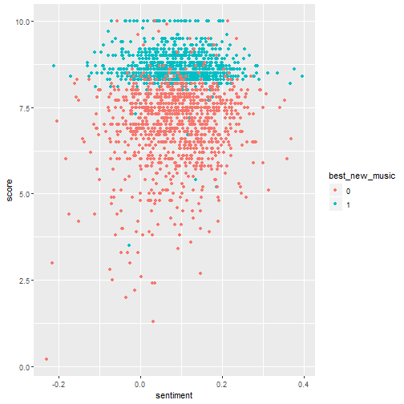

There is no visibal relationship between score and sentiment. But we can see the threshod in score for best new music.


```r
sample1 %>% 
  group_by(pub_year) %>% 
  summarize(meanSenti = mean(sentiment)) %>% 
  ggplot(aes(x=pub_year, y = meanSenti))+
  geom_line()+
  geom_point()+
  ylim(0,0.11)+
  theme_minimal()
```

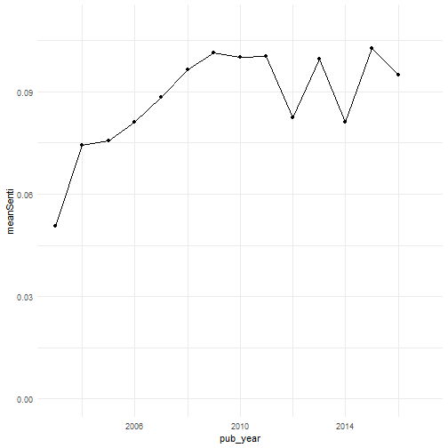

The review sentiment was climbing up before 2010. And went up and down after 2010. But it is varying in a small range.


```r
sample1 %>% 
  group_by(pub_year) %>% 
  summarize(meanScore = mean(score)) %>% 
  ggplot(aes(x = pub_year, y = meanScore))+
  geom_line()+
  geom_point()+
  theme_minimal()
```

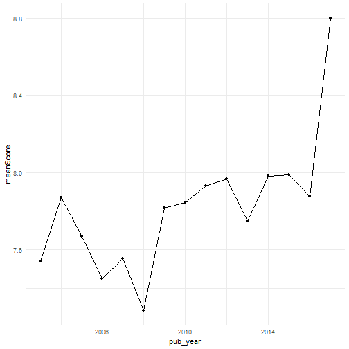

Again, 2010 seems to be a dividing point for scores.

## Topic Models


```r
library(stm)
predictorText = textProcessor(documents = sample1$content, 
                          metadata = sample1, 
                          stem = FALSE)
```

```
## Building corpus... 
## Converting to Lower Case... 
## Removing punctuation... 
## Removing stopwords... 
## Removing numbers... 
## Creating Output...
```

```r
pfPrep = prepDocuments(documents = predictorText$documents, 
                               vocab = predictorText$vocab,
                               meta = predictorText$meta)
```

```
## Removing 18277 of 41296 terms (18277 of 658465 tokens) due to frequency 
## Your corpus now has 1942 documents, 23019 terms and 640188 tokens.
```


```r
kTest = searchK(documents = pfPrep$documents, 
             vocab = pfPrep$vocab, 
             K = c(3, 4, 5, 7, 10), verbose = FALSE)

#png(file = "./pfktest2.png", width = 800, height = 600)
plot(kTest)
#dev.off()
```

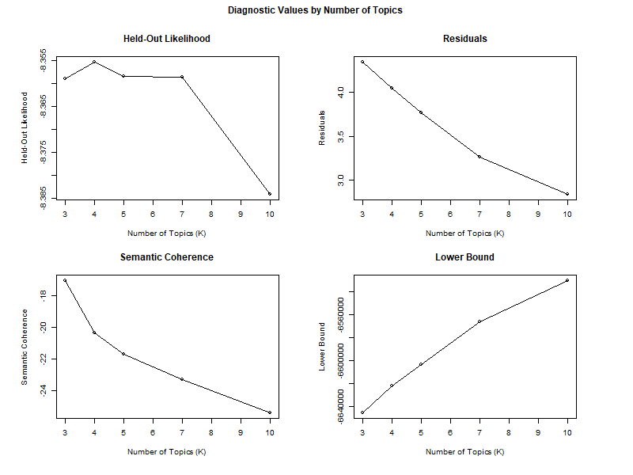

Choose 5 as the number of topics.


```r
topics5 = stm(documents = pfPrep$documents, 
             vocab = pfPrep$vocab, seed = 1234,
             K = 5, verbose = FALSE)
```


```r
plot(topics5)
```

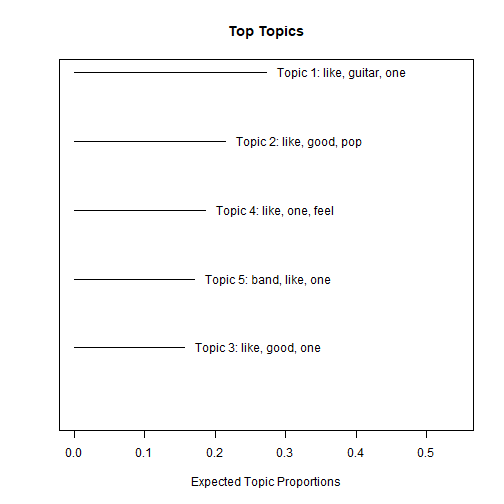

```r
labelTopics(topics5)
```

```
## Topic 1 Top Words:
##  	 Highest Prob: like, guitar, one, make, band, good, feel 
##  	 FREX: deerhunter, techno, sunn, electronic, ambient, lopatin, voigt 
##  	 Lift: aaa, aberration, ableton, abundant, acab, acorn, acquiescence 
##  	 Score: sunn, cox, techno, herndon, deerhunter, stott, chardiet 
## Topic 2 Top Words:
##  	 Highest Prob: like, good, pop, one, make, band, just 
##  	 FREX: corgan, lekman, olsen, pumpkin, pornographer, buckingham, vampire 
##  	 Lift: absolution, absurdism, affluence, aimee, alliances, amelia, amorous 
##  	 Score: lekman, corgan, buckingham, olsen, pornographer, barcelona, seeds 
## Topic 3 Top Words:
##  	 Highest Prob: like, good, one, make, rap, get, just 
##  	 FREX: rapper, nas, kendrick, rap, thug, neptunes, nigga 
##  	 Lift: aap, abstinence, acrobat, adaptable, adderall, adeles, adidas 
##  	 Score: rap, rapper, nas, thug, nigga, beyoncé, gucci 
## Topic 4 Top Words:
##  	 Highest Prob: like, one, feel, make, good, way, sing 
##  	 FREX: coltrane, jaar, maus, onyeabor, owens, mccombs, stevens 
##  	 Lift: abstruse, adz, affairs, agoraphobic, backer, baldi, bebop 
##  	 Score: jaar, onyeabor, maus, krell, hadreas, mccombs, bowles 
## Topic 5 Top Words:
##  	 Highest Prob: band, like, one, rock, good, make, new 
##  	 FREX: molina, sleater, eastman, remaster, reissue, bikini, ono 
##  	 Lift: acme, acquisition, afrique, albarns, alphabet, ation, baez 
##  	 Score: molina, band, sleater, eastman, bikini, erickson, paramount
```

Looks like each topic is one type of genre, and FREX are mostly artists in the same topic.


```r
topicPredictor = stm(documents = pfPrep$documents,
             vocab = pfPrep$vocab, prevalence = ~ score,
             data = pfPrep$meta, K = 5, verbose = FALSE)
```


```r
ratingEffect = estimateEffect(1:5 ~ score, stmobj = topicPredictor,
               metadata = pfPrep$meta)

summary(ratingEffect, topics = c(1:5))
```

```
## 
## Call:
## estimateEffect(formula = 1:5 ~ score, stmobj = topicPredictor, 
##     metadata = pfPrep$meta)
## 
## 
## Topic 1:
## 
## Coefficients:
##              Estimate Std. Error t value Pr(>|t|)    
## (Intercept)  0.417173   0.046938   8.888  < 2e-16 ***
## score       -0.020249   0.005925  -3.418 0.000645 ***
## ---
## Signif. codes:  0 '***' 0.001 '**' 0.01 '*' 0.05 '.' 0.1 ' ' 1
## 
## 
## Topic 2:
## 
## Coefficients:
##              Estimate Std. Error t value Pr(>|t|)    
## (Intercept)  0.373768   0.043059   8.680  < 2e-16 ***
## score       -0.020254   0.005477  -3.698 0.000224 ***
## ---
## Signif. codes:  0 '***' 0.001 '**' 0.01 '*' 0.05 '.' 0.1 ' ' 1
## 
## 
## Topic 3:
## 
## Coefficients:
##              Estimate Std. Error t value Pr(>|t|)    
## (Intercept) 1.588e-01  4.551e-02   3.490 0.000494 ***
## score       5.478e-05  5.788e-03   0.009 0.992449    
## ---
## Signif. codes:  0 '***' 0.001 '**' 0.01 '*' 0.05 '.' 0.1 ' ' 1
## 
## 
## Topic 4:
## 
## Coefficients:
##             Estimate Std. Error t value Pr(>|t|)    
## (Intercept) 0.045664   0.043347   1.053 0.292262    
## score       0.018882   0.005528   3.416 0.000649 ***
## ---
## Signif. codes:  0 '***' 0.001 '**' 0.01 '*' 0.05 '.' 0.1 ' ' 1
## 
## 
## Topic 5:
## 
## Coefficients:
##             Estimate Std. Error t value Pr(>|t|)    
## (Intercept) 0.005425   0.045205   0.120 0.904482    
## score       0.021468   0.005754   3.731 0.000196 ***
## ---
## Signif. codes:  0 '***' 0.001 '**' 0.01 '*' 0.05 '.' 0.1 ' ' 1
```


```r
plot.estimateEffect(ratingEffect, "score", method = "continuous",
                    model = topicPredictor, topics = 1, labeltype = "frex")
```

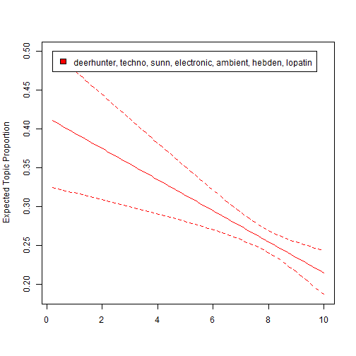

```r
plot.estimateEffect(ratingEffect, "score", method = "continuous",
                    model = topicPredictor, topics = 2, labeltype = "frex")
```

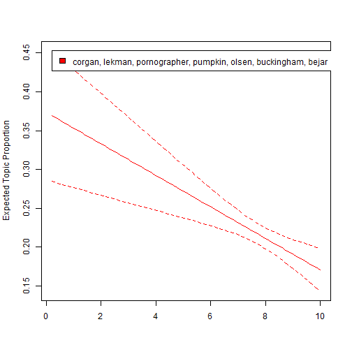

```r
plot.estimateEffect(ratingEffect, "score", method = "continuous",
                    model = topicPredictor, topics = 3, labeltype = "frex")
```

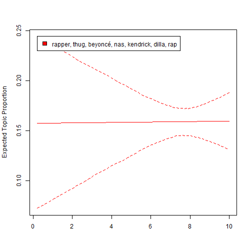

```r
plot.estimateEffect(ratingEffect, "score", method = "continuous",
                    model = topicPredictor, topics = 4, labeltype = "frex")
```


```r
plot.estimateEffect(ratingEffect, "score", method = "continuous",
                    model = topicPredictor, topics = 5, labeltype = "frex")
```

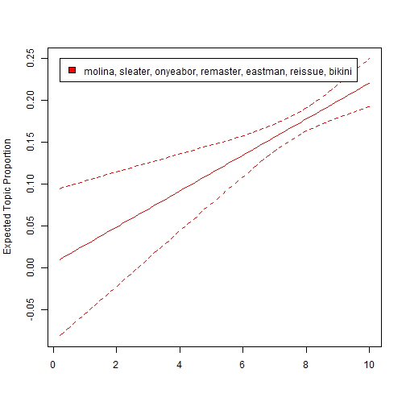

We can see the topic proportion are related to scores for some topics.

## Predict best new music

From previous visualization, we can see score is an important factor of best new music.  
Let's try to use a logistic regression to predict it.

```r
library(DMwR)
library(InformationValue)
library(caret)
set.seed(1234)

sample_set <- sample1 %>% 
  pull(.) %>% 
  sample.split(SplitRatio = .7)

pfTrain <- subset(sample1, sample_set == TRUE)
pfTest <- subset(sample1, sample_set == FALSE)
```

### Logistic Regression

```r
logit.mod <- glm(best_new_music ~ score, family = "binomial", data = pfTrain)

summary(logit.mod)
```

```
## 
## Call:
## glm(formula = best_new_music ~ score, family = "binomial", data = pfTrain)
## 
## Deviance Residuals: 
##     Min       1Q   Median       3Q      Max  
## -4.1919  -0.1730  -0.0006   0.4381   6.5341  
## 
## Coefficients:
##             Estimate Std. Error z value Pr(>|z|)    
## (Intercept) -37.5732     2.2772  -16.50   <2e-16 ***
## score         4.6359     0.2771   16.73   <2e-16 ***
## ---
## Signif. codes:  0 '***' 0.001 '**' 0.01 '*' 0.05 '.' 0.1 ' ' 1
## 
## (Dispersion parameter for binomial family taken to be 1)
## 
##     Null deviance: 1882.53  on 1359  degrees of freedom
## Residual deviance:  658.78  on 1358  degrees of freedom
## AIC: 662.78
## 
## Number of Fisher Scoring iterations: 7
```


```r
logit_pred <- predict(logit.mod, pfTest, type = 'response')
ideal_cutoff <-
  optimalCutoff(
    actuals = pfTest$best_new_music,
    predictedScores = logit_pred,
    optimiseFor = "Both"
  )

logit_pred2 <- ifelse(logit_pred > ideal_cutoff, 1, 0)
logit.matrix <- caret::confusionMatrix(as.factor(logit_pred2), pfTest$best_new_music, positive = "1")
logit.matrix
```

```
## Confusion Matrix and Statistics
## 
##           Reference
## Prediction   0   1
##          0 264  10
##          1  25 284
##                                           
##                Accuracy : 0.94            
##                  95% CI : (0.9175, 0.9578)
##     No Information Rate : 0.5043          
##     P-Value [Acc > NIR] : < 2e-16         
##                                           
##                   Kappa : 0.8799          
##                                           
##  Mcnemar's Test P-Value : 0.01796         
##                                           
##             Sensitivity : 0.9660          
##             Specificity : 0.9135          
##          Pos Pred Value : 0.9191          
##          Neg Pred Value : 0.9635          
##              Prevalence : 0.5043          
##          Detection Rate : 0.4871          
##    Detection Prevalence : 0.5300          
##       Balanced Accuracy : 0.9397          
##                                           
##        'Positive' Class : 1               
## 
```

Logistic regression achieved 95% accuracy and a kappa of 89.7%. 

### SVM

```r
library(kernlab)

svmTrainControl = trainControl(method = "cv", number = 10, verboseIter = FALSE)

set.seed(1234)
svmPf = train(best_new_music ~ score, data = pfTrain,
  method = "svmLinear", trControl = svmTrainControl, 
  tuneGrid = data.frame(C = c(.001, .1, .5, 1, 5, 10, 30)), 
  metric = "Accuracy", preProc = c("center", "scale"))

ggplot(svmPf) +
  theme_minimal()
```

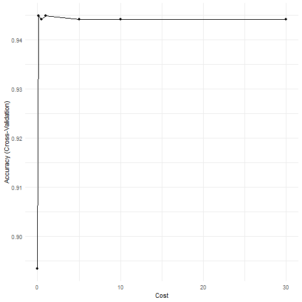

0.1 gives us a really good accuracy.


```r
svmPfTuned = train(best_new_music ~ score, data = pfTrain,
  method = "svmLinear", trControl = svmTrainControl, 
  tuneGrid = data.frame(C = 1), 
  metric = "Accuracy", preProc = c("center", "scale"))

svmPfTest = predict(svmPfTuned, pfTest)

svmMat <- confusionMatrix(svmPfTest, pfTest$best_new_music,positive = "1")
svmMat
```

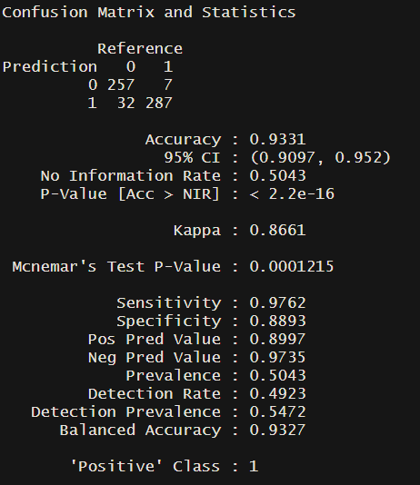

Logistic regression slightly outperforms SVM. (Knitted output is the same as logistic regression somehow. I use a screenshot of Rstudio output here)

## Predict score with topic thetas and sentiment

In topic modeling, we see some topic thetas are correlated with score. Let's try using thetas and sentiment to predict score.


```r
thetas = topicPredictor$theta
```


```r
sample1_pred <- sample1 %>% 
  mutate(topic1theta = thetas[,1],
         topic2theta = thetas[,2],
         topic3theta = thetas[,3],
         topic4theta = thetas[,4],
         topic5theta = thetas[,5]) %>% 
  select(-content)
```


```r
set.seed(1234)
sample_set <- sample1_pred %>% 
  pull(.) %>% 
  sample.split(SplitRatio = .7)

pfTrain <- subset(sample1_pred, sample_set == TRUE)
pfTest <- subset(sample1_pred, sample_set == FALSE)
```


```r
lmod <- lm(score~sentiment+topic2theta+ topic3theta+topic4theta+topic5theta, data=pfTrain)
summary(lmod)
```

```
## 
## Call:
## lm(formula = score ~ sentiment + topic2theta + topic3theta + 
##     topic4theta + topic5theta, data = pfTrain)
## 
## Residuals:
##     Min      1Q  Median      3Q     Max 
## -7.0778 -0.6451  0.2126  0.8071  2.9516 
## 
## Coefficients:
##             Estimate Std. Error t value Pr(>|t|)    
## (Intercept)  7.58992    0.09201  82.487  < 2e-16 ***
## sentiment    1.66563    0.39471   4.220 2.61e-05 ***
## topic2theta -1.06255    0.13991  -7.595 5.73e-14 ***
## topic3theta -0.04409    0.14099  -0.313 0.754520    
## topic4theta  0.58238    0.15228   3.824 0.000137 ***
## topic5theta  0.93197    0.14594   6.386 2.34e-10 ***
## ---
## Signif. codes:  0 '***' 0.001 '**' 0.01 '*' 0.05 '.' 0.1 ' ' 1
## 
## Residual standard error: 1.216 on 1353 degrees of freedom
## Multiple R-squared:  0.1282,	Adjusted R-squared:  0.1249 
## F-statistic: 39.78 on 5 and 1353 DF,  p-value: < 2.2e-16
```

Even though the linear model does not fit well. We can see sentiment, topic2theta, topic4theta, and topic5theta are significant predictors.


