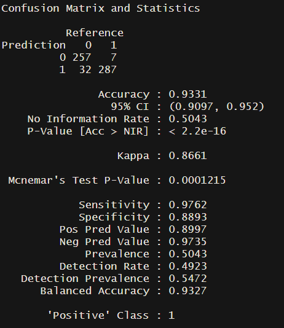

```{r setup, include=FALSE}
knitr::opts_chunk$set(echo = TRUE, warning = FALSE, message = FALSE)
```

```{r, message = FALSE, warning=FALSE, include=FALSE}
library(tidyverse)
library(lubridate)
library(tm)
library(tidytext)
library(widyr)
library(wordcloud2)
library(textstem)
library(ggwordcloud)
library(lexicon)
library(textdata)
library(stringr)
library(caTools)
library(RSQLite)
library(sentimentr)
library(lexicon)
library(magrittr)
library(png)
```

## Load and sample the data

The data is a SQLite database, using DBI and dbplyr to query the database. The dataset is downloaded from [Kaggle](https://www.kaggle.com/nolanbconaway/pitchfork-data)
```{r}
library(DBI)
# Create an ephemeral in-memory RSQLite database
con <- dbConnect(RSQLite::SQLite(), "./database.sqlite")
```

```{r}
reviews <- tbl(con, "reviews")
artists <- tbl(con, "artists")
content <- tbl(con, "content")
genres <- tbl(con, "genres")
years <- tbl(con, "years")

```

```{r}
allContent <- reviews %>% 
  inner_join(content, by=c("reviewid"="reviewid")) %>% 
  arrange(desc(pub_year)) %>% 
  select(reviewid, title, artist, score, author, author_type, content, pub_year, best_new_music) %>% 
  distinct() %>% 
  collect()

allContent1 <- allContent %>% 
  mutate(best_new_music=as.factor(best_new_music)) %>% 
  filter(pub_year>=2003)
```


There are over 18000 reivews in the data. With limited computation power for text mining, we can only use a subset of the data. Here, I selected 2000 samples, 943 of them are best_new_music, rest are not. The best_new_music class is also balanced this way.  

```{r}
set.seed(1234)

bestNew <- allContent1 %>% 
  filter(best_new_music=="1")

notBest <- allContent1 %>% 
  filter(best_new_music == "0")

notBestIndex <- sample(1:nrow(notBest), 1000, replace= FALSE)
notBestSample <- notBest[notBestIndex,]

sample <- rbind(bestNew, notBestSample)
```

```{r, include=FALSE}
# Disconnect from the database
dbDisconnect(con)
```

## Wordcloud

Let's first see the high frequency words in reviews in a wordcloud.  
```{r, warning=FALSE}
reviewContent <- sample %>% 
  mutate(content = tolower(content),
         content = lemmatize_strings(content),
         content = str_replace_all(content, "\\-", " "),
         content = stripWhitespace(content),
         content = removeNumbers(content))

mystopwords <- c("song", "album", "music", "track", "record", "sound","release", "much", "can")

tokens <-  reviewContent %>% 
  unnest_tokens(word, content) %>% 
  anti_join(stop_words) %>%
  filter(!(word %in% mystopwords)) %>% 
  count(word) %>% 
  mutate(freq = n/sum(n)) %>% 
  top_n(n = 50, wt = freq)

tokens %>% 
  ggplot(aes(label = word, size = freq, color = word))+
  geom_text_wordcloud_area()+
  scale_size_area(max_size = 20)+
  theme_minimal()
```

The frequent words in Pitchfork's reviews are mostly about genres, feelings and some musical terms. Very standard words you expect to see in music reviews. 

## Sentiment Analysis

```{r, eval=FALSE}
reviewSenti = sentiment(get_sentences(allContent), 
          polarity_dt = lexicon::hash_sentiment_jockers,
          valence_shifters_dt = lexicon::hash_valence_shifters)

reviewSenti1 = reviewSenti %>% 
  group_by(reviewid) %>% 
  summarize(sentiment = mean(sentiment))
```

```{r,include=FALSE}
#write.csv(reviewSenti,"E:/Local MSBA course work/unstructured/proj/reviewSentiSentence.csv", row.names = FALSE)
#write.csv(reviewSenti1,"E:/Local MSBA course work/unstructured/proj/reviewSenti.csv", row.names = FALSE)
#reviewSenti = read.csv("E:/Local MSBA course work/unstructured/proj/reviewSentiSentence.csv")
reviewSenti1 = read.csv("./reviewSenti.csv")
```

Add sentiments back to our data frame. And remove some unimportant words
```{r, message=FALSE}
sample1 <- reviewContent %>% 
  inner_join(reviewSenti1) %>% 
  mutate(content = removeWords(content, mystopwords)) %>% 
  filter(reviewid != 10497) # this review does not have content
```

```{r}
sample1 %>% 
  ggplot(aes(x=sentiment, y = score, color = best_new_music))+
  geom_point()
```

There is no visibal relationship between score and sentiment. But we can see the threshod in score for best new music.

```{r}
sample1 %>% 
  group_by(pub_year) %>% 
  summarize(meanSenti = mean(sentiment)) %>% 
  ggplot(aes(x=pub_year, y = meanSenti))+
  geom_line()+
  geom_point()+
  ylim(0,0.11)+
  theme_minimal()
```

The review sentiment was climbing up before 2010. And went up and down after 2010. But it is varying in a small range.

```{r}
sample1 %>% 
  group_by(pub_year) %>% 
  summarize(meanScore = mean(score)) %>% 
  ggplot(aes(x = pub_year, y = meanScore))+
  geom_line()+
  geom_point()+
  theme_minimal()
```

Again, 2010 seems to be a dividing point for scores.

## Topic Models

```{r, message=FALSE}
library(stm)
predictorText = textProcessor(documents = sample1$content, 
                          metadata = sample1, 
                          stem = FALSE)
pfPrep = prepDocuments(documents = predictorText$documents, 
                               vocab = predictorText$vocab,
                               meta = predictorText$meta)
```

```{r,eval=FALSE}
kTest = searchK(documents = pfPrep$documents, 
             vocab = pfPrep$vocab, 
             K = c(3, 4, 5, 7, 10), verbose = FALSE)

#png(file = "./pfktest2.png", width = 800, height = 600)
plot(kTest)
#dev.off()
```


Choose 5 as the number of topics.

```{r, include=FALSE}
#saveRDS(topics5, "./topics5.rds")
topics5 <- readRDS("./topics5.rds")
```

```{r, eval=FALSE}
topics5 = stm(documents = pfPrep$documents, 
             vocab = pfPrep$vocab, seed = 1234,
             K = 5, verbose = FALSE)
```

```{r}
plot(topics5)
labelTopics(topics5)
```

Looks like each topic is one type of genre, and FREX are mostly artists in the same topic.

```{r,include=FALSE}
#saveRDS(topicPredictor, "./topicPredictor.rds")
topicPredictor <- readRDS("./topicPredictor.rds")
```


```{r, eval=FALSE}
topicPredictor = stm(documents = pfPrep$documents,
             vocab = pfPrep$vocab, prevalence = ~ score,
             data = pfPrep$meta, K = 5, verbose = FALSE)
```

```{r}
ratingEffect = estimateEffect(1:5 ~ score, stmobj = topicPredictor,
               metadata = pfPrep$meta)

summary(ratingEffect, topics = c(1:5))
```


```{r}
plot.estimateEffect(ratingEffect, "score", method = "continuous",
                    model = topicPredictor, topics = 1, labeltype = "frex")
plot.estimateEffect(ratingEffect, "score", method = "continuous",
                    model = topicPredictor, topics = 2, labeltype = "frex")
plot.estimateEffect(ratingEffect, "score", method = "continuous",
                    model = topicPredictor, topics = 3, labeltype = "frex")
plot.estimateEffect(ratingEffect, "score", method = "continuous",
                    model = topicPredictor, topics = 4, labeltype = "frex")
plot.estimateEffect(ratingEffect, "score", method = "continuous",
                    model = topicPredictor, topics = 5, labeltype = "frex")
```

We can see the topic proportion are related to scores for some topics.

## Predict best new music

From previous visualization, we can see score is an important factor of best new music.  
Let's try to use a logistic regression to predict it.
```{r}
library(DMwR)
library(InformationValue)
library(caret)
set.seed(1234)

sample_set <- sample1 %>% 
  pull(.) %>% 
  sample.split(SplitRatio = .7)

pfTrain <- subset(sample1, sample_set == TRUE)
pfTest <- subset(sample1, sample_set == FALSE)
```

### Logistic Regression
```{r}
logit.mod <- glm(best_new_music ~ score, family = "binomial", data = pfTrain)

summary(logit.mod)
```

```{r}
logit_pred <- predict(logit.mod, pfTest, type = 'response')
ideal_cutoff <-
  optimalCutoff(
    actuals = pfTest$best_new_music,
    predictedScores = logit_pred,
    optimiseFor = "Both"
  )

logit_pred2 <- ifelse(logit_pred > ideal_cutoff, 1, 0)
logit.matrix <- caret::confusionMatrix(as.factor(logit_pred2), pfTest$best_new_music, positive = "1")
logit.matrix
```

Logistic regression achieved 95% accuracy and a kappa of 89.7%. 

### SVM
```{r, message=FALSE, warning=FALSE}
library(kernlab)

svmTrainControl = trainControl(method = "cv", number = 10, verboseIter = FALSE)

set.seed(1234)
svmPf = train(best_new_music ~ score, data = pfTrain,
  method = "svmLinear", trControl = svmTrainControl, 
  tuneGrid = data.frame(C = c(.001, .1, .5, 1, 5, 10, 30)), 
  metric = "Accuracy", preProc = c("center", "scale"))

ggplot(svmPf) +
  theme_minimal()
```

0.1 gives us a really good accuracy.

```{r,eval=FALSE}
svmPfTuned = train(best_new_music ~ score, data = pfTrain,
  method = "svmLinear", trControl = svmTrainControl, 
  tuneGrid = data.frame(C = 1), 
  metric = "Accuracy", preProc = c("center", "scale"))

svmPfTest = predict(svmPfTuned, pfTest)

svmMat <- confusionMatrix(svmPfTest, pfTest$best_new_music,positive = "1")
svmMat
```



Logistic regression slightly outperforms SVM. (Knitted output is the same as logistic regression somehow. I use a screenshot of Rstudio output here)

## Predict score with topic thetas and sentiment

In topic modeling, we see some topic thetas are correlated with score. Let's try using thetas and sentiment to predict score.

```{r}
thetas = topicPredictor$theta
```

```{r, include=FALSE}
#write.csv(sample1_pred, "./sample1_pred.csv")
sample1_pred <- read.csv("./sample1_pred.csv")
```


```{r, eval=FALSE}
sample1_pred <- sample1 %>% 
  mutate(topic1theta = thetas[,1],
         topic2theta = thetas[,2],
         topic3theta = thetas[,3],
         topic4theta = thetas[,4],
         topic5theta = thetas[,5]) %>% 
  select(-content)
```

```{r}
set.seed(1234)
sample_set <- sample1_pred %>% 
  pull(.) %>% 
  sample.split(SplitRatio = .7)

pfTrain <- subset(sample1_pred, sample_set == TRUE)
pfTest <- subset(sample1_pred, sample_set == FALSE)
```


```{r}
lmod <- lm(score~sentiment+topic2theta+ topic3theta+topic4theta+topic5theta, data=pfTrain)
summary(lmod)
```

Even though the linear model does not fit well. We can see sentiment, topic2theta, topic4theta, and topic5theta are significant predictors.


